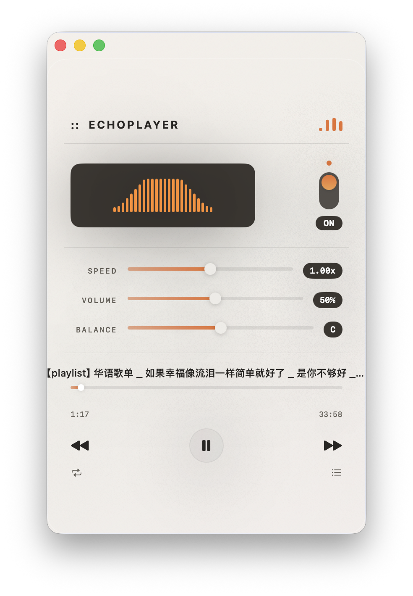

# EchoPlayer

一个极简的 macOS 音频播放器，温暖的复古质感。基于 SwiftUI 构建。

<p align="center">
  
</p>

[English](README.md)

## 功能

- **拖放即播** — 直接拖音频文件到播放器，即刻播放
- **文件夹歌单** — 选择歌单文件夹，自动扫描并监听新增曲目
- **24段可视化** — 随音乐律动的平滑频率条动画
- **播放控制** — 播放/暂停、上一首、下一首、可拖拽进度条
- **变速播放** — 0.5x 到 2.0x 倍速
- **音量与声道** — 独立音量滑块和左右声道平衡
- **循环模式** — 关闭 / 单曲循环 / 列表循环
- **键盘快捷键** — 空格（播放/暂停）、方向键（快退/快进 10s，音量 ±10%）
- **毛玻璃 UI** — 奶油色温暖背景 + 半透明玻璃卡片 + 橙色点缀
- **复古开关** — 电源拨钮 + 摩尔斯电码开机音效

## 支持格式

MP3 · WAV · FLAC · M4A · AAC · OGG · WMA

## 系统要求

- macOS 14.0+ (Sonoma)
- Xcode 15+（从源码编译时需要）

## 从源码构建

```bash
git clone https://github.com/zo00e11/EchoPlayer.git
cd EchoPlayer
open EchoPlayer.xcodeproj
```

`Cmd + R` 编译运行。

## 项目结构

```
EchoPlayer/
├── Audio/
│   ├── AudioEngine.swift              # 核心音频引擎
│   └── AudioEngine+FolderWatcher.swift # 歌单文件夹扫描与监听
├── Views/
│   ├── TitleBar.swift                 # 歌曲信息头部
│   ├── EqualizerView.swift            # 24段动态可视化
│   ├── ProgressBar.swift              # 可拖拽进度条
│   ├── SliderRow.swift                # 通用标签滑块
│   └── PlaylistSheet.swift            # 播放列表浮层
├── Theme/
│   ├── Colors.swift                   # 配色方案（暖橙 / 奶油色）
│   └── GlassEffect.swift              # 毛玻璃效果
├── ContentView.swift                  # 主界面布局
└── EchoPlayerApp.swift                # 应用入口
```

## 开源协议

MIT
